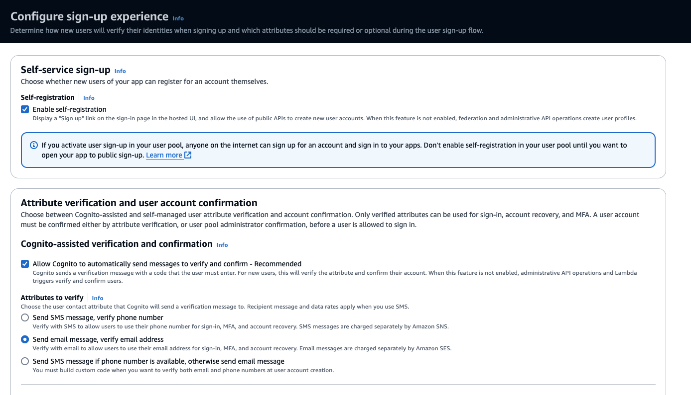

# Amazon Cognito authentication for the application

You can optionally turn on a setting to require authentication for the application. Amazon Cognito is an identity platform for web and mobile apps. It’s a user directory, an authentication server, and an authorization service for OAuth 2.0 access tokens and AWS credentials. With Amazon Cognito, you can authenticate and authorize users from the built-in user directory, from your enterprise directory, and from consumer identity providers like Google and Facebook. It can authenticate against a Amazon Cognito Userpool. To get more details about Amazon Cognito you can refer to the [documentation.](https://docs.aws.amazon.com/cognito/latest/developerguide/what-is-amazon-cognito.html)

When the setting is turned on, you will see a Login button appear and a prompt asking the user to login

To setup authentication with cognito, do the following steps

## Setup Cognito domain
This application requires AppIntegration settings with Cognito user pool and you can configure to create AppIntegration and get the client secret ID. If you don't have a Cognito user pool already configured, you can create manually or create one using the given [CloudFormation template](cf_templates/cognito_domain_creation.yml). 

To create the domain manually, execute the below steps. Using AWS Console navigate to Cognito service. Click on "User Pools" and click "Create User pool".  You will have to execute a series of steps

Step 1 is configure sign-in experience. Leave Cognito user pool checked and under sign-in options, select User name and leave the rest unchecked

In the next step you will Configure security requirements. Leave the defaults for password policy. For Multi-factor authentication, select No MFA (For production applications it is recommended to enable MFA). Disable self-service account recovery if number of users is small and for testing purposes. 

In the next step you will configure sign-up experience. Leave the following configurations. 

For messages, enable Cognito to send the email. Leave the default address

In the final step, you will configure application integration settings. You will enter User Pool Name, and Cognito domain. 

Enter Public client and Call back URL which is the Streamlit application URL 

Under advanced app client settings, enable ALLOW_USER_PASSWORD_AUTH

Finally enter Signout URL which is the Streamlit application URL 

Review, confirm the settings and click Submit to create the domain

## Configure environment variables
Once the domain is created, we need to provide the details to the streamlit application via environment variables. Easisest way is to modify the .env file under applications folder. It has following settings

* ENFORCE_LOGIN
* COGNITO_DOMAIN=
* CLIENT_ID
* CLIENT_SECRET
* CALLBACK_URL

Change the value of ENFORCE_LOGIN to 1 to enable authentication. CALLBACK_URL is the streamlit application URL and copy rest of the settings from Cognito console. 

Restart the application and you will see the Login button on the screen!

