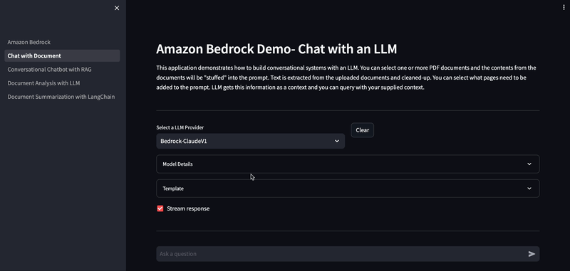

# Amazon Bedrock Demo with Streamlit

Streamlit is an open-source Python framework for building quick user interface to demo AI/ML applications. There are two applications in this repo built with streamlit. 
You can find a more in-depth introduction to Streamlit from [Get started](https://docs.streamlit.io/library/get-started) page.




You can run the streamlit application either from locally or from SageMaker Studio 


# A) Instructions to run locally
Follow the below instructions to run the application locally. 

### Install and Setup
Execute the following commands from terminal. Create a conda environment using the environment.yml file. 

``` bash
conda env create -f environment.yml
source activate bedrock-gen-ai-app
```

### Run application 
After you have installed, run the following command to launch demo application. This runs the application to run on port 8081, restrict maximum file size for upload to 10MB. Both settings can be changed.

```bash
streamlit run Amazon_Bedrock.py --server.port 8081 --server.maxUploadSize 10
```

### Launch application UI
You can navigate to the application UI using the folowing URL format. Replace the values in angle brackets. 

http://localhost:&lt;Port&gt;/


# B) Instructions to run on SageMaker Studio
Setup Streamlit environemnt. Below assumes you have extracted code to /home/sagemaker-user/bedrock_onboarding directory

```bash
cd /home/sagemaker-user/bedrock_onboarding/applications
conda env create -f environment.yml
source activate bedrock-gen-ai-app
```
### Run application 
After you have installed, run the following command to launch demo application. This runs the application to run on port 8081, restrict maximum file size for upload to 10MB. Both settings can be changed.

```bash
streamlit run Amazon_Bedrock.py --server.port 8081 --server.maxUploadSize 10
```

### Launch application UI
If you are running this app from SageMaker studio, SageMaker automatically will use a proxy to run the application. You can navigate to the application UI using the folowing URL format. Replace the values in angle brackets. Alternatively, you can execute the code cells in the notebook [app_launcher.ipynb](app_launcher.ipynb) to create the URL for you.

https://&lt;DomainName&gt;.studio.&lt;StudioRegion&gt;.sagemaker.aws/jupyter/default/proxy/&lt;Port&gt;/


# Stop & Clean-up
To stop the application, go to terminal and kill the application Ctrl +C
Deactivate conda environment created to exit out

```bash
conda deactivate 
```

You can view all conda environments by running this command
```bash
conda env list
```

Remove the environment created

```bash
conda remove --name bedrock-gen-ai-app --all
```

To verify that the environment was removed, run
```bash
conda info --envs
```